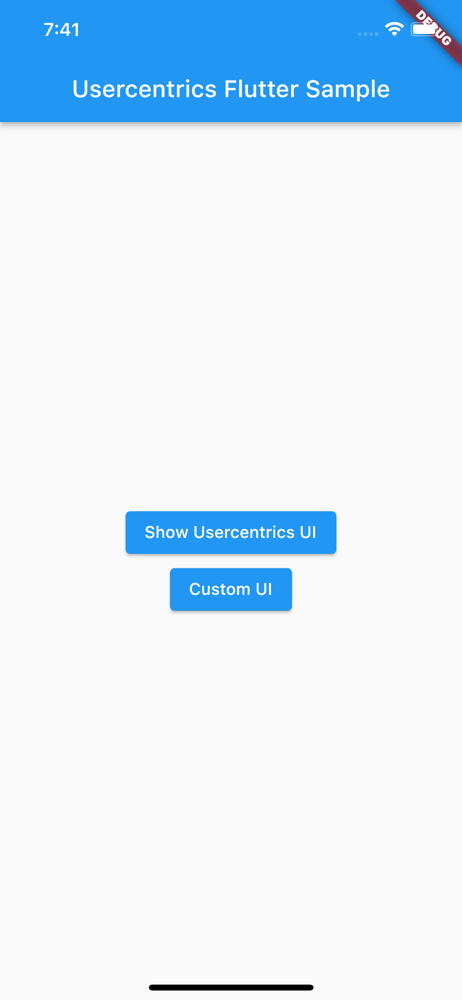
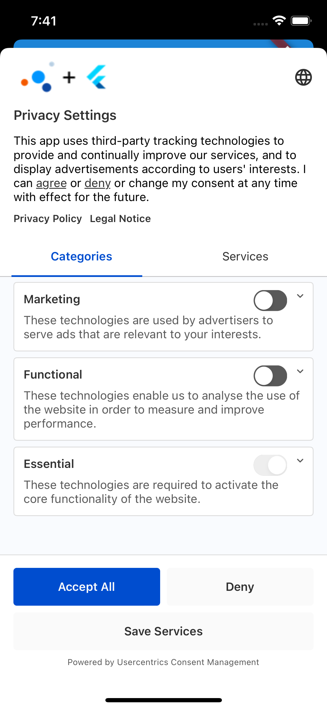
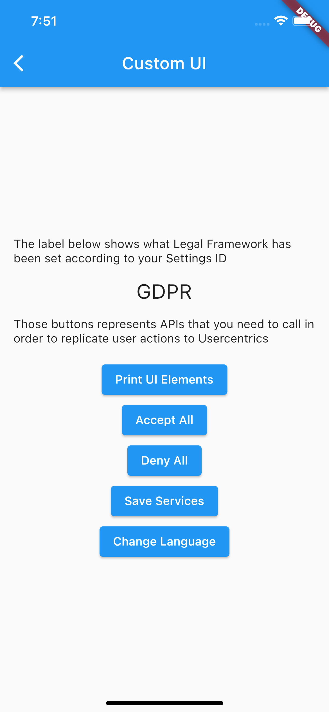

# Usercentrics SDK for Flutter - Quickstart

The goal of this project is to show how to use Usercentrics SDK inside of a Flutter application.

## Instructions

This project is a starting point for a Flutter application.

- Step 1: Clone the repository

- Step 2: Get the dependencies by executing `flutter pub get`

- Step 3: Run the application by executing `flutter run`

## Result

After running the app you should see a screen like this:

### UsercentricsUI

### CustomUI

### Consent Mediation

You can enable and run the Consent Mediation example in this example by following the [documentation](https://usercentrics.com/docs/apps/features/consent-mediation/#enable-mediation).

## Learn more

- Check out the full [documentation](https://docs.usercentrics.com/cmp_in_app_sdk).
- Check our [website](https://usercentrics.com).
