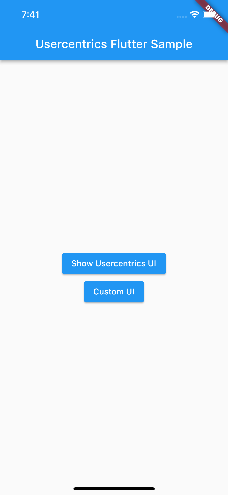
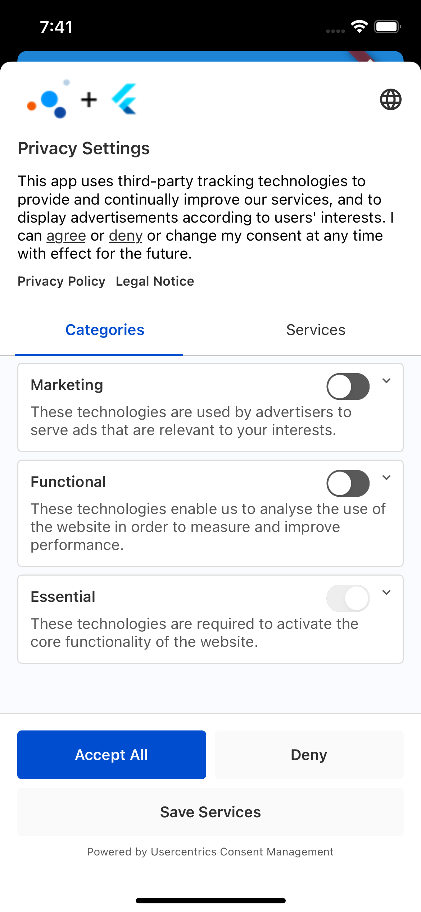
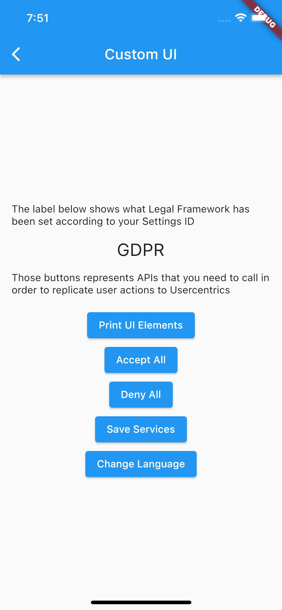

# Usercentrics SDK for Flutter — Example App

This app demonstrates how to integrate and test the Usercentrics SDK in a Flutter application, including consent mediation with Firebase Analytics.

---

## Prerequisites

- [Flutter SDK](https://docs.flutter.dev/get-started/install) installed
- For iOS: Xcode + CocoaPods (`gem install cocoapods`)
- For Android: Android Studio or a connected device/emulator

---

## Running the App (without Consent Mediation)

No Firebase setup is required for the standard flow.

**Step 1 — Clone the repository**
```bash
git clone https://github.com/Usercentrics/flutter-sdk.git
cd flutter-sdk
```

**Step 2 — Install dependencies**
```bash
flutter pub get
```

**Step 3 — iOS only: install pods**

> **Note:** The iOS Podfile includes a local path override for `UsercentricsUI` pointing to
> `../../../mobile-sdk/platforms/ios/UsercentricsUI`. This is used for testing local
> mobile-sdk changes without a full release. If you do not have the `mobile-sdk` repository
> checked out at that relative path, remove or comment out that line in `example/ios/Podfile`
> before running `pod install`:
> ```ruby
> # pod 'UsercentricsUI', :path => '../../../mobile-sdk/platforms/ios/UsercentricsUI'
> ```

```bash
cd example/ios && pod install && cd ../..
```

**Step 4 — Run the app**
```bash
cd example && flutter run
```

> **Note:** Consent mediation is **enabled by default** in this example app
> (`_kMediationTestEnabled = true`). To run without mediation, pass the flag explicitly:
> ```bash
> flutter run --dart-define=MEDIATION_TEST=false
> ```
> Without Firebase config files in place, the app will still run but Firebase will not
> initialise — you will see an error in the logs. Add the config files as described below
> to test mediation end-to-end.

---

## App Features

After running the app you should see a screen like this:



### UsercentricsUI

The default Usercentrics-provided consent banner.



### Custom UI

Build your own consent UI using the raw consent data from the SDK.



### Customization Examples

Two built-in examples (`Customization Example 1` and `Customization Example 2`) show how to customise the banner appearance — fonts, colours, button layouts, and layer settings — using `BannerSettings`.

### Webview Integration

Demonstrates how to inject the user's Usercentrics session data into a `WebView` so the Browser CMP can pick up the native consent without asking the user again.

### GPP Testing

A dedicated screen for testing the Global Privacy Platform (GPP) API:
- Fetch and display the encoded GPP string
- Fetch full GPP data (applicable sections and field values)
- Set consent values for specific GPP sections (e.g. `usnat`, `usfl`)
- Monitor real-time `onGppSectionChange` stream events

---

## Running the App with Consent Mediation

Consent mediation automatically forwards the user's consent decisions to integrated third-party SDKs (e.g. Firebase Analytics). Testing this requires Firebase to be configured in the app.

### Step 1 — Create a Firebase project

1. Go to the [Firebase Console](https://console.firebase.google.com)
2. Click **Add project** and follow the setup wizard
3. Once the project is created, register two apps (Android + iOS) in the next steps

### Step 2 — Register the Android app and download `google-services.json`

1. In your Firebase project, click **Add app** → select **Android**
2. Enter the package name: `com.usercentrics.sdk.mediation.test`
3. Click **Register app**
4. Download the `google-services.json` file
5. Place it at:
   ```
   example/android/app/google-services.json
   ```

### Step 3 — Register the iOS app and download `GoogleService-Info.plist`

1. In your Firebase project, click **Add app** → select **iOS**
2. Enter the bundle ID: `com.usercentrics.sdk.mediation.test`
3. Click **Register app**
4. Download the `GoogleService-Info.plist` file
5. Place it at:
   ```
   example/ios/Runner/GoogleService-Info.plist
   ```

> **Note:** Both config files are excluded from version control (`.gitignore`) as they
> contain API keys. You must add them locally before running the app with mediation.

### Step 4 — Run the app

Since mediation is enabled by default, simply run:

```bash
cd example && flutter run
```

To explicitly disable mediation:

```bash
cd example && flutter run --dart-define=MEDIATION_TEST=false
```

### Step 5 — Test consent mediation

1. Tap **Initialize SDK** — the Usercentrics CMP will appear
2. Accept or deny consent
3. Check the debug logs — you should see mediation output like:
   ```
   [USERCENTRICS][DEBUG] [Mediation] Firebase - Consent applied successfully.
   ```

> **Important:** Consent is persisted locally on the device. To re-test mediation from a
> clean state, clear the app data (Android) or uninstall and reinstall the app (iOS)
> before running again.

---

## Settings ID

The example app uses the settings ID `Yi9N3aXia` by default, configured in
`example/lib/main.dart`. To test with your own Usercentrics configuration, replace it
with your settings ID from the [Usercentrics Admin Interface](https://admin.usercentrics.eu).

---

## Learn More

- [Usercentrics Documentation](https://docs.usercentrics.com/cmp_in_app_sdk)
- [Consent Mediation Guide](https://usercentrics.com/docs/apps/features/consent-mediation/#enable-mediation)
- [Usercentrics Website](https://usercentrics.com)
